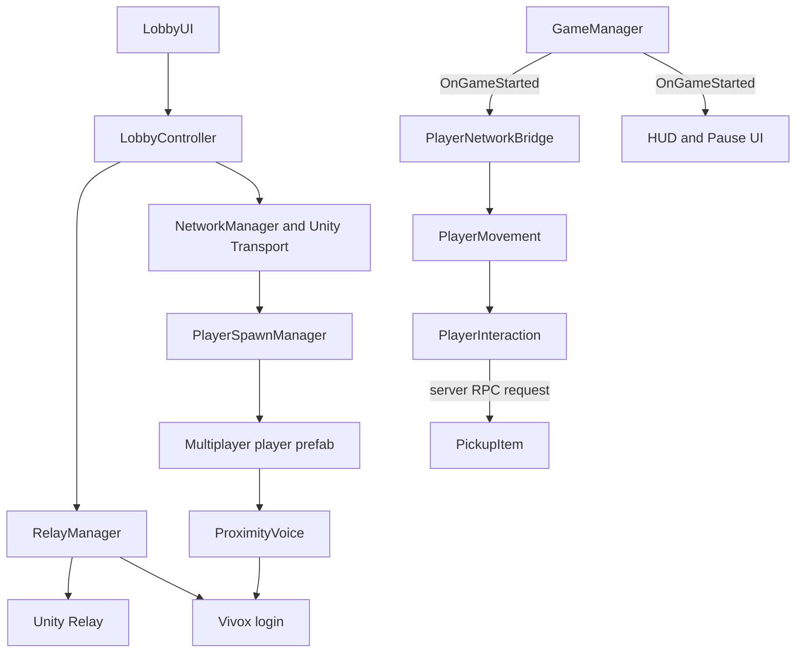

# Repository Guide for Aspiring Game Developers

This repository is a small Unity 6 first-person multiplayer demo. Its most useful lesson is not any single mechanic, but how it separates local player feel, synchronized game state, online session setup, voice chat, and UI. Study `Assets/Scripts` first; treat `Assets/Samples/Vivox` as vendor sample code rather than part of the game's architecture.

The project is intentionally compact, so it is a good learning reference. It is not a production-ready networking framework: some server-side requests need stronger validation, disconnect/reconnect handling is basic, and several systems use convenient scene lookups and singletons.

## What the demo contains

- A multiplayer scene that starts as a local host, then can switch to a Unity Relay host or client session.
- An offline-style single-player scene that reuses the same movement controller.
- First-person walking, sprinting, jumping, coyote time, jump buffering, air control, and ground slam.
- Server-controlled spawning, player colors, game phase, and held-item movement.
- Unity Relay for internet connectivity and Vivox for positional voice chat.
- UI Toolkit menus and HUDs.
- A CharacterController-based player, Cinemachine camera transition, and URP rendering.

## Recommended reading order

1. Read `PlayerMovementSettings.cs`, then `PlayerMovement.cs`. This is the clearest local gameplay loop.
2. Read `PlayerNetworkBridge.cs` to see how local-only behavior is separated from network ownership.
3. Read `GameManager.cs` and `PlayerSpawnManager.cs` to understand synchronized state and server-only responsibilities.
4. Read `PlayerInteraction.cs` together with `PickupItem.cs`. They demonstrate the request/authority split between a player and a networked world object.
5. Read `LobbyController.cs` together with `RelayManager.cs`. They show orchestration versus service integration.
6. Read `ProximityVoice.cs`, then the UI scripts.
7. Inspect the multiplayer player prefab and both scenes in the Unity Inspector. Serialized references and component configuration are part of the implementation and cannot be understood from C# alone.

## Project map

| Location | Purpose | Study priority |
| --- | --- | --- |
| `Assets/Scripts` | Project-owned gameplay, networking, service, and UI code | Highest |
| `Assets/Scenes/Multiplayer.unity` | NetworkManager, RelayManager, GameManager, spawn manager, lobby UI, level, and camera setup | Highest |
| `Assets/Scenes/Singleplayer.unity` | Small standalone setup that reuses the movement code | High |
| `Assets/Prefabs/Multiplayer Controller.prefab` | Player component composition, camera hierarchy, input, network components, and visuals | Highest |
| `Assets/Prefabs/Singleplayer Controller.prefab` | Non-networked version of the player | High |
| `Assets/Prefabs/Item.prefab` | Rigidbody, collider, PickupItem, and network synchronization setup | High |
| `Assets/Input/PlayerActions.inputactions` | Named input actions and bindings | High |
| `Assets/Settings/PlayerMovementSettings.asset` | Actual movement tuning values used by the player | High |
| `Assets/UI Toolkit` | UXML layouts, USS styling, and panel settings | Medium |
| `Assets/Samples/Vivox` | Imported Vivox package sample | Low unless learning Vivox APIs specifically |
| `Packages/manifest.json` | Exact Unity package dependencies and versions | Reference |
| `ProjectSettings` | Unity version and project-wide engine configuration | Reference |

## Main tools and packages

The repository targets Unity `6000.3.5f2`. Its important packages are:

| Tool | Role in this demo | Pattern to reuse |
| --- | --- | --- |
| Netcode for GameObjects 2.12.0 | NetworkObject lifecycle, ownership, RPCs, NetworkVariables, and player spawning | Keep authoritative state in NetworkBehaviours and gate local input with `IsOwner` |
| Unity Transport and Multiplayer Services 2.2.3 | Local transport plus Relay allocations and join codes | Keep service code behind a small manager rather than placing it in UI classes |
| Vivox 16.11.0 | Login, positional channels, speaking state, and local mute controls | Derive a voice room from session identity and update 3D position from the owning player |
| Input System 1.17.0 | Actions such as Move, Look, Jump, Sprint, Slam, Interact, and Crouch | Gameplay code reads named actions; bindings remain editable in the input asset |
| Cinemachine 3.1.3 | Transition from the menu camera to the player's camera | Use a virtual camera for presentation, then hand control to the first-person camera |
| UI Toolkit | Lobby, HUD, pause menu, and single-player menu | Keep UXML/USS presentation separate from C# event wiring |
| Universal Render Pipeline 17.3.0 | Rendering and camera post-processing | Camera code can enable URP-specific features without owning the whole rendering setup |
| ProBuilder | Greybox level geometry | Prototype traversal and multiplayer spaces before investing in final art |

## Runtime architecture



The recurring pattern is: UI raises intent, a controller coordinates the use case, a service manager talks to an external service, and NetworkBehaviours own synchronized state. Local movement remains an ordinary MonoBehaviour and is enabled only for the owning client.

## Main C# files

### PlayerMovement.cs

This is the local first-person motor. It reads Input System actions, rotates the player and camera, calculates horizontal and vertical velocity, and calls `CharacterController.Move` once per frame. It also exposes the camera ray used by interaction.

Important ideas to learn:

- Horizontal and vertical velocity are kept separately. This makes jumping, gravity, air control, and ground slam easier to reason about.
- Coyote time permits a jump shortly after leaving a ledge; jump buffering remembers a press shortly before landing. Both are small additions that noticeably improve game feel.
- Camera look stops while an item is being rotated, preventing two systems from consuming the same mouse delta at once.
- The menu-to-player camera transition is presentation logic around the moment gameplay begins.

Pay attention to the order in `HandleMovement`: read grounded state and input, update timers, resolve jump and slam, update horizontal motion, apply gravity, then perform one final move. When adding mechanics, decide explicitly where they enter this order.

### PlayerMovementSettings.cs

This ScriptableObject holds tunable movement values outside the controller code. Designers can create different assets for different movement styles without duplicating code.

Reuse this pattern for crouch speed, standing and crouched heights, camera transition time, acceleration, throw force, or other balancing values. Keep true runtime state, such as “is currently crouching,” in a component rather than in the shared settings asset.

### PlayerNetworkBridge.cs

This component connects Netcode ownership and the synchronized game phase to the local `PlayerMovement` component.

- Remote player instances have their input disabled and their movement script turned off.
- Only the owning player subscribes to the game-start event.
- Remote objects are moved to the Default layer so local first-person cameras can see them.

This is a strong reusable boundary: the movement motor does not need to know about Netcode. Keep new local movement rules in `PlayerMovement`; put ownership and replicated presentation in a NetworkBehaviour.

### GameManager.cs

This NetworkBehaviour owns the match phase through a server-writable `NetworkVariable<GameState>`. When the value changes to `Playing`, it raises a normal C# event used by player and UI components.

The useful pattern is translating replicated network state into a local event. In a larger game, expand the enum into states such as Loading, Countdown, Playing, Results, and ReturningToLobby. Also add authorization rules for who may request a transition.

### PlayerSpawnManager.cs

The server enables connection approval, limits capacity to the number of spawn points, manually instantiates the configured player prefab, and calls `SpawnAsPlayerObject` for the connecting client.

This is where player admission and initial spawn placement belong. A production version should track free spawn slots by client ID so a disconnected player's slot can be reused; the current monotonically increasing index does not do that.

### PlayerInteraction.cs

This owner-only NetworkBehaviour handles the player's interaction intent. It raycasts using the ray produced by `PlayerMovement`, requests pickup or drop through the target item, and uses look input to rotate a held object.

It is deliberately thin: the player detects intent, while the item owns its synchronized held state. Follow that pattern for doors, switches, weapons, and usable objects. Consider introducing an `IInteractable` interface when several unrelated object types need the same raycast interaction entry point.

### PickupItem.cs

This is the authoritative side of held-object behavior. `HeldBy` is readable by everyone but writable only by the server. The server moves held items toward the holder's camera, avoids placing them through nearby geometry, drops jammed items, and applies throw force on release.

The important multiplayer lesson is that an RPC is a request, not proof. Before using this pattern in a competitive or hostile environment, validate the RPC sender, distance to the item, line of sight, current holder, rotation limits, and permission to drop. In particular, avoid trusting a client-supplied client ID when the RPC context can identify the sender.

### LobbyController.cs

This is the session-flow coordinator. It wires UI events, starts a local host immediately, initializes online services, switches between local and Relay sessions, and recovers from transport failure.

It demonstrates orchestration: the class knows the sequence of operations but delegates Relay details to `RelayManager` and presentation to `LobbyUI`. As the game grows, model this sequence as explicit session states so repeated clicks, cancellation, timeouts, and error messages are easier to handle.

### RelayManager.cs

This service-facing class initializes Unity Services, signs in anonymously, logs in to Vivox, creates or joins Relay allocations, configures Unity Transport, and leaves the active session.

Keep credentials, authentication, matchmaking, Relay, and voice initialization in a service layer like this. Do not mix movement or scene UI details into it. For a shipped game, expose richer result/error types and cancellation rather than relying on `async void` callers and console logs.

### ProximityVoice.cs

Each owning player joins a positional Vivox channel named from the Relay join code. During updates it sends listener/speaker position and copies local speech detection into an owner-writable NetworkVariable so all clients can show a speaking icon.

Study the distinction between local service state and replicated presentation state. For production, rate-limit network updates that do not need to run every rendered frame, handle device and permission failures, and decide whether voice identity should be independent from a short-lived join code.

### PlayerColour.cs

The server assigns a spawn index; all clients observe it and apply the corresponding head material. This is a small, clear example of a server-writable NetworkVariable driving presentation on every client.

Use a `MaterialPropertyBlock` rather than `renderer.material` if many players or frequent color changes would otherwise create material instances.

### LobbyUI.cs

This class queries named UI Toolkit elements, publishes button clicks as C# events, reads the join-code field, and switches among idle, hosting, and client visual states.

Its reusable idea is that a UI view reports intent but does not create network sessions itself. In a larger UI, move colors and most styling into USS and keep the script focused on state and events.

### HudUI.cs and PauseUI.cs

`HudUI` reveals the HUD after the replicated game-start event. `PauseUI` handles Escape, cursor state, the Vivox participant list, local mute controls, leaving, and scene reload.

Note that “pause” in a multiplayer game should normally pause only local input and open a menu; it should not set `Time.timeScale` to zero for the shared simulation. This project follows that principle.

### DemoManager.cs

This is the single-player scene adapter. It hides its menu, starts the same `PlayerMovement`, and quits the application. It shows the value of keeping the movement component independent from networking.

### SpineAim.cs

This cosmetic script maps camera pitch to an eye-mesh offset in `LateUpdate`. LateUpdate is appropriate because it reacts after normal camera/player updates. In a more sophisticated character, this role would usually be performed by animation rigging or an Animator layer.

### Extra/VictoryZone.cs

This optional NetworkBehaviour marks a server-writable completion flag when an unheld PickupItem remains in its trigger, invokes a UnityEvent on all observers, and applies a local visual physics effect.

It is a useful prototype of a networked objective. A full game should define whether the resulting physics is authoritative or purely cosmetic, unsubscribe callbacks on despawn, and make victory part of the central game-state flow rather than an isolated boolean.

## Patterns worth carrying into another project

### Separate configuration from runtime state

`PlayerMovementSettings` contains reusable tuning; `PlayerMovement` contains per-player state. This makes iteration safer and supports multiple character presets.

### Separate input intent from authority

`PlayerInteraction` says “I want to pick this up.” `PickupItem` decides and changes replicated state. Apply this to damage, inventory, doors, objectives, and abilities. The authoritative side must validate every assumption supplied by a client.

### Gate player code by ownership

Only the owning player should read input, control its first-person camera, or publish owner-controlled state. Remote player copies should render synchronized results without creating extra cameras or consuming local input.

### Use synchronized state for durable facts and RPCs for requests

Game phase, player index, current holder, and speaking indicator are modeled as NetworkVariables because late joiners need their current values. Pickup, drop, and start-game operations are requests. This distinction is one of the most important concepts in multiplayer design.

### Keep views passive

`LobbyUI` publishes events; `LobbyController` performs the workflow. This makes it easier to replace the visual layout, test logic, and prevent network code from spreading through button callbacks.

### Treat prefab and Inspector configuration as code

The C# files depend on serialized camera, settings, renderer, material, input, and spawn references. When moving these patterns to another project, copy the component relationships intentionally; copying only scripts will produce null references or incorrect ownership behavior.

## Adding crouching in the existing design

The input asset already contains a `Crouch` action bound to keyboard `C` and the gamepad East button. The missing work belongs primarily in `PlayerMovement.cs` and `PlayerMovementSettings.cs`.

### 1. Add tunable values

Add these kinds of fields to `PlayerMovementSettings.cs`:

```csharp
[Header("Crouch")]
public float crouchSpeed = 5f;
public float crouchedHeight = 1.1f;
public float crouchTransitionSpeed = 12f;
```

The standing height, standing center, and camera's initial local position should normally be captured from the prefab in `PlayerMovement.Awake`. That avoids duplicating values that already live on the CharacterController and Transform.

### 2. Read the existing action

Add `_crouchAction`, assign it from `_playerInput.actions["Crouch"]` in `EnableActions`, and enable it alongside the other gameplay actions. Add `_isCrouching` and any transition state to `PlayerMovement`, because they are runtime state rather than configuration.

### 3. Resolve stance before movement speed

Call a `HandleCrouch` method near the beginning of `HandleMovement`, before choosing walk or sprint speed. Crouching should usually cancel sprint and choose `crouchSpeed`.

The method should:

- Decide whether crouch is hold-to-crouch or toggle-to-crouch.
- Change `CharacterController.height` and `center` together so the feet remain planted.
- Move `_cameraPoint.localPosition` smoothly for the first-person viewpoint.
- Prevent standing when a ceiling is overhead.

Do not check clearance with a single upward ray. Use the standing capsule shape with `Physics.CheckCapsule` or a capsule cast, and exclude the player's own collider/layer. Otherwise the player may stand inside ceilings or incorrectly block itself.

### 4. Keep interaction and camera behavior coherent

Because `InteractRay` starts at `_cameraPoint`, it will automatically follow the crouched camera if the camera point is moved. Verify that held-item placement in `PickupItem` also feels correct, because it finds the same `CameraPoint` transform.

### 5. Decide what must be networked

Local collision and camera behavior can remain in `PlayerMovement`, following the existing motor pattern. Other players will not automatically see a crouched pose merely because the owner changed its local CharacterController.

If crouch must be visible remotely, add a focused NetworkBehaviour such as `PlayerStanceNetwork` to the multiplayer player prefab. It can observe the local motor, send a validated stance request, and expose a small NetworkVariable or Animator parameter for remote presentation. Avoid expanding `PlayerNetworkBridge` into a catch-all; its current responsibility is ownership and game-start bridging.

If crouching changes a gameplay-relevant hitbox, line of sight, or damage rules, the server must validate and apply that stance to the authoritative representation. A purely owner-writable visual flag is not sufficient for competitive gameplay.

### 6. Update both player prefabs deliberately

- Add the local crouch settings and camera behavior to both multiplayer and single-player controller prefabs.
- Add replicated stance presentation only to the multiplayer prefab.
- Confirm the existing `Crouch` action is enabled by the PlayerInput action map.
- Check the standing and crouched capsule gizmos in the Scene view.

### 7. Test the edge cases

- Crouch and stand while stationary and moving.
- Try to stand under a low ceiling.
- Walk off a ledge while crouched and land under an obstacle.
- Jump, slam, sprint, rotate an item, and open the pause menu while crouched.
- Pick up an item before and after crouching.
- Test as host and client and watch the player from the other instance.
- Test reconnects and late joins if stance is synchronized.

## Where to add other missing features

| Feature | Primary location | Supporting changes |
| --- | --- | --- |
| Footsteps and landing audio | New local presentation component beside `PlayerMovement` | Read movement/grounded state; avoid putting audio playback inside the motor |
| Health and damage | New server-authoritative NetworkBehaviour on the player | NetworkVariable for current health, validated damage requests, HUD observer |
| Weapons | New owner input component plus server-authoritative weapon component | Input actions, networked fire validation, pooled effects, inventory state |
| General interactions | Evolve `PlayerInteraction` around an `IInteractable` contract | Server validation on each target object |
| Match countdown and results | Expand `GameState` and `GameManager` | Lobby/HUD panels respond to state changes |
| Respawning | `PlayerSpawnManager` plus a dedicated health/respawn service | Reuse freed spawn slots and preserve client ownership |
| Player names | New networked player-profile component | Source identity from authentication; render in HUD/world UI |
| Settings menu | New UI Toolkit view and settings service | Apply input sensitivity, audio devices, voice volume, and persist locally |
| Animation | Animator/presentation component on the player prefab | Drive it from movement and replicated stance/speed state |
| Save data | New persistence service outside gameplay components | Serialize stable IDs and settings, not scene object references |

## Important limitations to learn from

- Server authority is only as strong as request validation. Several item RPCs demonstrate the structure but do not fully validate the sender, range, or line of sight.
- The spawn manager does not reclaim spawn indices after disconnects.
- Multiple systems use `FindFirstObjectByType` and global singletons. Convenient for a demo, these become hidden dependencies in a larger game.
- Several asynchronous UI flows use `async void`. That is acceptable for event entry points, but production workflows benefit from cancellation, debouncing, explicit progress states, and centralized error handling.
- Update-driven voice and network state should be measured and rate-limited when scaling beyond a small four-player sample.
- UnityEvents and NetworkVariable subscriptions need symmetrical cleanup. Use `OnNetworkDespawn` when objects may be spawned and despawned repeatedly.
- The project is host-based. A host can still cheat, and the session ends or needs migration when the host leaves unless you design additional infrastructure.

## A practical learning exercise

Implement crouching in three passes:

1. Make it work in `Singleplayer.unity` with capsule resizing, camera motion, reduced speed, and ceiling clearance.
2. Reuse the same local motor behavior in `Multiplayer.unity`, confirming only the owner reads input.
3. Add remote stance presentation and decide which parts require server authority.

That sequence mirrors the repository's architecture and forces you to understand input, movement order, prefab composition, ownership, replicated state, and testing across multiple clients without introducing an unnecessarily large feature.
